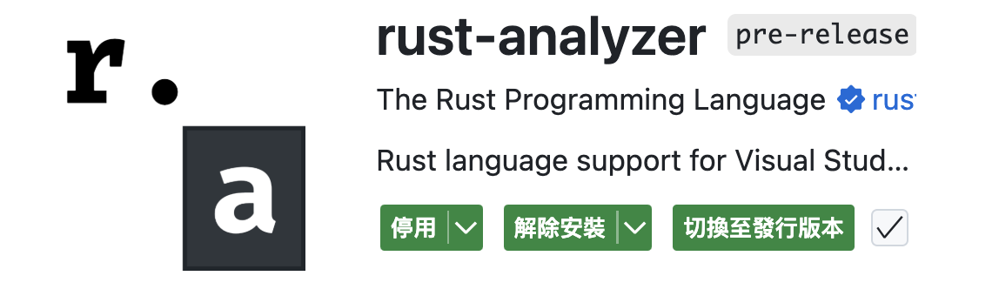
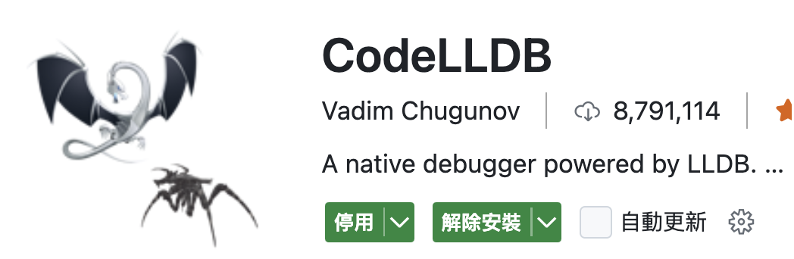
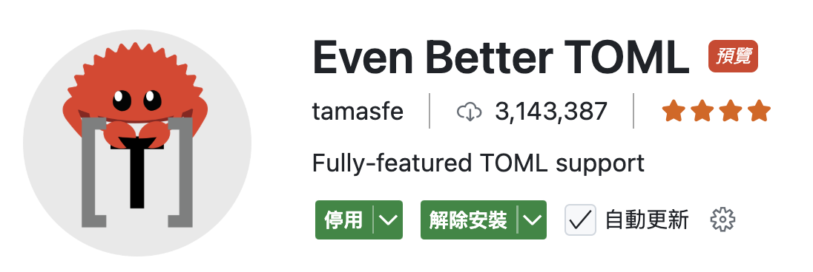
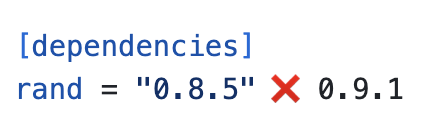
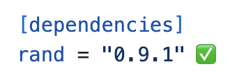
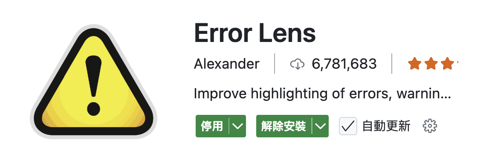
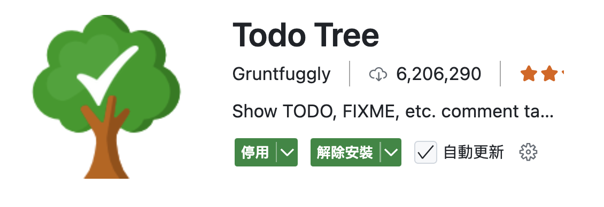
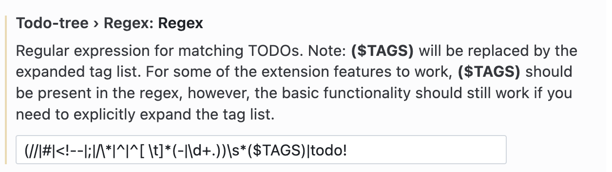

# Recommand extensions

## 1. rust-analyzer

必裝的 extension，他可以給你 type hint, inline error 或查看 definition...。特別好用。

## 2. CodeLLDB

幫助 rust 進行 debug 的工具，我還沒試過，等試過再回來分享心得。

## 3. Even Better TOML

可以對 toml 檔進行 syntax highlight，除此之外好像還有其他功能，等弄到了再回來分享。

## 4. Dependi

非常好用的工具，他可以直接在 rust 的 cargo.toml 檔中查看並挑選套件的版本。紅色叉叉❌表示你用的套件版本不是最新的，綠色勾勾✅則表示是最新的版本。
|||
|-|-|
|||

只要 hover 在版本上面就可以直接查看並挑選！

## 5. Error Lens

這個工具可以直接 inline 顯示錯誤訊息，蠻好看的。

## 6. Todo Tree

這個工具會 highlight 你寫的 `//TODO` 或是 `//FIXME` 註解，除此之外，因為 rust 有時候會用到 `todo!()` macro，所以他也可以被 highlight，更容易看到還有什麼地方沒完成。不過要注意的是，如果想讓 `todo!()` 也被 highlght 的話要去 vscode 的`設定`-> 輸入 `todo tree regex`->然後加上 `|todo!` 如下圖！

# References

[Let's Get Rusty: Ultimate VS Code setup for Rust development (2025)
](https://www.youtube.com/watch?v=ZhedgZtd8gw)